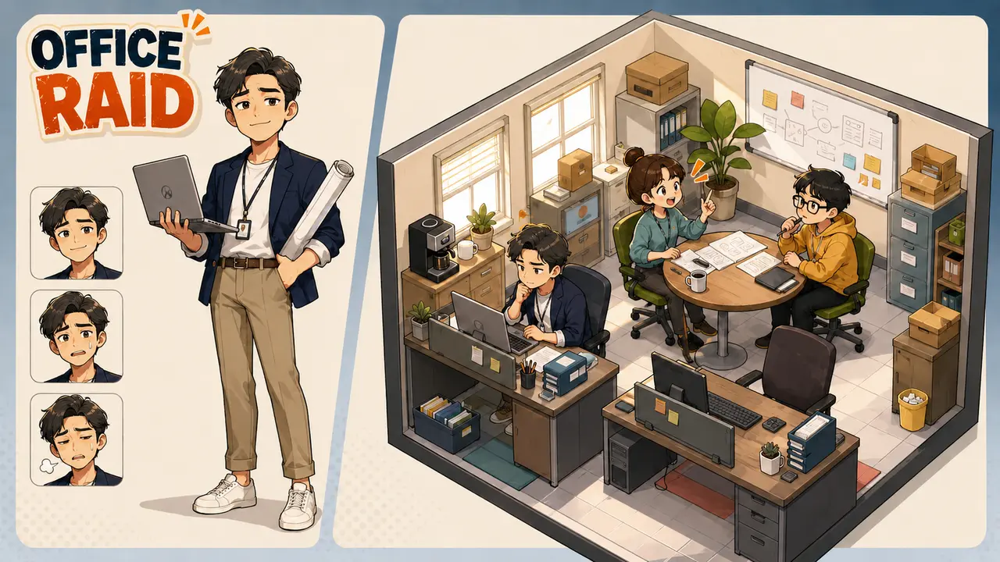
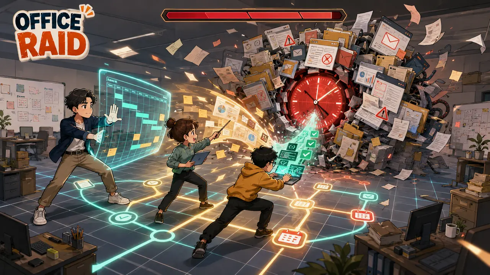
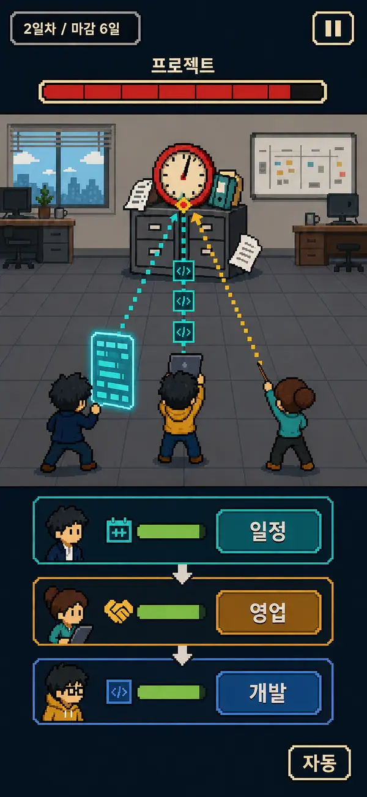

# OFFICE RAID

동료들과 힘을 합쳐 거대한 프로젝트를 공략하는 회사 경영 RPG입니다.

작은 회사에서 시작해 다양한 직원을 채용하고, 부서별 능력과 직원 간 협업을 활용해 프로젝트를 완료합니다. 프로젝트에서 얻은 보상으로 직원과 장비를 성장시키고 더 큰 회사로 확장합니다.

## 핵심 구성

- 회사 내부 운영과 성장
- 절차적으로 생성되는 면접 후보자
- 부서별 역할을 활용한 프로젝트 전투
- 직원 간 스킬 연계와 팀 시너지
- 등급별 장비와 프로젝트 보상

## 현재 단계

Unity 6.3 LTS Android 프로젝트와 설치 없이 실행 가능한 브라우저 프로토타입을 함께 개발하고 있습니다.

**[모바일 웹 미리보기 실행](https://ming87-star.github.io/office-raid/)**

현재 구현된 흐름:

1. 직접 입력하거나 랜덤 생성한 회사 이름 결정
2. 대표 이름과 얼굴형·피부·머리·눈·눈썹·코·입·의상·액세서리 커스터마이징
3. 대표를 포함한 초기 직원 3명으로 회사 시작
4. 절차적으로 생성된 후보자 면접과 채용
5. PM·영업·개발의 업무 연계 자동 전투
6. 프로젝트 완료 후 현금·평판·장비 획득
7. 채용한 직원 중 프로젝트 참가자 3명 편성
8. 요구사항 변경·긴급회의·예산 삭감·고객 승인 돌발 상황

## 실행 방법

1. Unity Hub에서 Unity 6.3 LTS와 Android Build Support를 설치합니다.
2. 이 저장소 폴더를 Unity Hub에서 프로젝트로 추가합니다.
3. `Assets/Scenes/Main.unity`를 엽니다.
4. Play 버튼을 눌러 프로토타입을 실행합니다.

현재 프로토타입 UI와 도트 스프라이트는 코드로 생성되므로 별도의 에셋 설치가 필요하지 않습니다.

화면은 Android 세로 모드를 기준으로 설계했습니다. 기준 해상도는 `360×780`이며 Canvas Scaler, 앵커 레이아웃과 안전 영역 보정으로 `9:16`부터 `9:21`까지 대응합니다. 사무실과 면접에서는 직원이 정면을 바라보고, 전투에서는 같은 외형의 뒷모습으로 위쪽 프로젝트 보스를 바라봅니다. 업무 효과도 직원에서 프로젝트를 향해 아래에서 위로 이동합니다.

자세한 내용은 [게임 기획서](docs/GAME_DESIGN.md)와 [기술 설계서](docs/TECHNICAL_DESIGN.md)를 참고하세요.

웹 미리보기와 선택적 Unity WebGL 자동 배포 설정은 [웹 미리보기 안내](docs/WEBGL_PREVIEW.md)를 참고하세요.

## 콘셉트 이미지

### 시작 회사와 캐릭터 스타일

### 프로젝트 전투의 시각적 은유

### 세로형 전투 화면과 공격 방향

